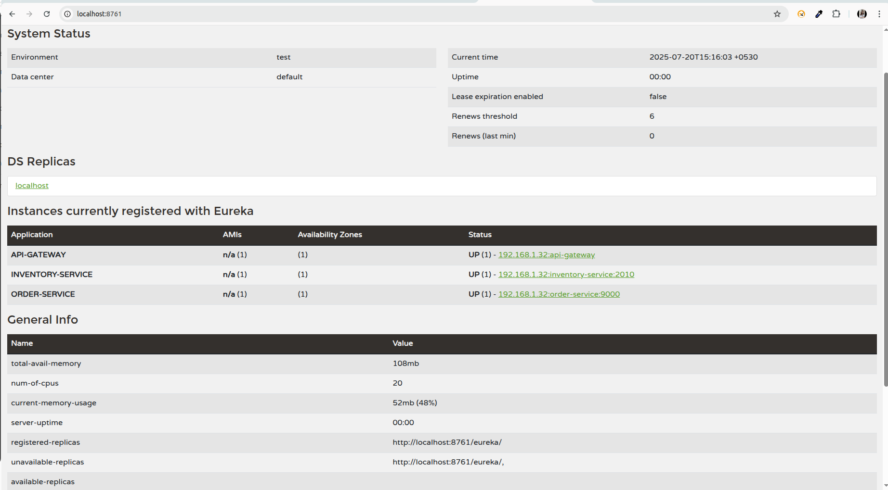

# Service Discovery with Spring Boot and Eureka
 A microservices architecture demonstrating service registration, discovery, and load balancing using Netflix Eureka and Spring Cloud Gateway.

## Architecture Overview
1. **Eureka Server**: Service registry and discovery server. 
2. **User Service**: Business service that registers with Eureka
3. **Order Service**: Business service that registers with Eureka
4. **API Gateway**: Routes requests using service discovery


## Core Concepts Explained
### 1. Client-Side vs Server-Side Service Discovery
**Client-Side Discovery** :

Client directly queries the service registry (Eureka)
Client maintains service instance cache locally
Client performs load balancing (Spring LoadBalancer)
Examples: Eureka with Ribbon/LoadBalancer

**Server-Side Discovery**:

Load balancer queries service registry
Client sends requests to load balancer
Load balancer routes to healthy instances
Examples: AWS ELB, Kubernetes Services


### 2. Eureka Dead Instance Detection
Eureka uses multiple mechanisms:

Heartbeats: Services send heartbeats every 30 seconds (configurable)
Lease Expiration: Instance marked DOWN if no heartbeat for 90 seconds
Self-Preservation: Disables eviction if >15% instances fail (prevents network partition issues)
Health Checks: Optional integration with Spring Boot Actuator


### 3. /actuator/health Endpoint Importance

Provides detailed application health status
Used by Eureka for health-based instance filtering
Returns UP/DOWN/OUT_OF_SERVICE status
Can include custom health indicators (DB, external APIs)
Enables proactive instance removal from load balancing


### 4. lb:// Routing with DiscoveryClient
````
# Gateway routes using service names
spring:
cloud:
gateway:
routes:
- id: user-service
uri: lb://user-service  # Service name from Eureka
predicates:
- Path=/users/** 

````
lb:// prefix indicates load-balanced routing
DiscoveryClient resolves service name to actual instances
LoadBalancer selects instance using configured algorithm
Automatic failover to healthy instances


### 5. Service Failure Handling
When a registered service goes down:

1. Immediate: Service stops sending heartbeats
2. 90 seconds: Eureka marks instance as DOWN (lease expiration)
3. Client Cache: LoadBalancer removes instance from local cache
4. Retry Logic: Failed requests retry with different instances
5. Circuit Breaker: Prevents cascading failures (if implemented)


### 6. Service Discovery Comparison

| Feature                    | **Eureka**                        | **Consul**                           | **Kubernetes DNS**                       |
| -------------------------- |-----------------------------------| ------------------------------------ | ---------------------------------------- |
| **Discovery Type**         | Client-side                       | Both (Client-side & Server-side)     | Server-side                              |
| **Registry Mechanism**     | In-memory registry (AP)           | Strong consistency via Raft (CP)     | etcd-backed DNS                          |
| **Health Checks**          | Basic (heartbeats & Actuator)     | Native HTTP/TCP/Script checks        | Liveness & Readiness probes              |
| **Load Balancing**         | Client-side (Spring LoadBalancer) | Both client-side & server-side       | Server-side (kube-proxy or service mesh) |
| **Service Mesh Support**   | No support available              | Connect available                  |        Istio/Linkerd integration      |
| **Configuration Features** | Minimal                           | Built-in KV store for dynamic config | ConfigMaps & Secrets                     |
| **Deployment Scope**       | Java-centric microservices        | Language-agnostic, multi-platform    | Kubernetes-native                        |
| **Integration Effort**     | Easy with Spring Boot             | Requires agent & additional setup    | Works out of the box in K8s              |

## 7. Spring LoadBalancer Instance Selection
Default Algorithm: Round Robin

> // Cycles through available instances sequentially                                                                                   
instance1 → instance2 → instance3 → instance1...

### Available Strategies:

1. RoundRobinLoadBalancer: Equal distribution 
2. RandomLoadBalancer: Random selection
3. Custom: Implement ReactiveLoadBalancer interface

### Selection Process:

1. Retrieve instances from DiscoveryClient
2. Filter healthy instances
3. Apply load balancing algorithm
4. Return selected ServiceInstance


### Services hosted on Eureka 

